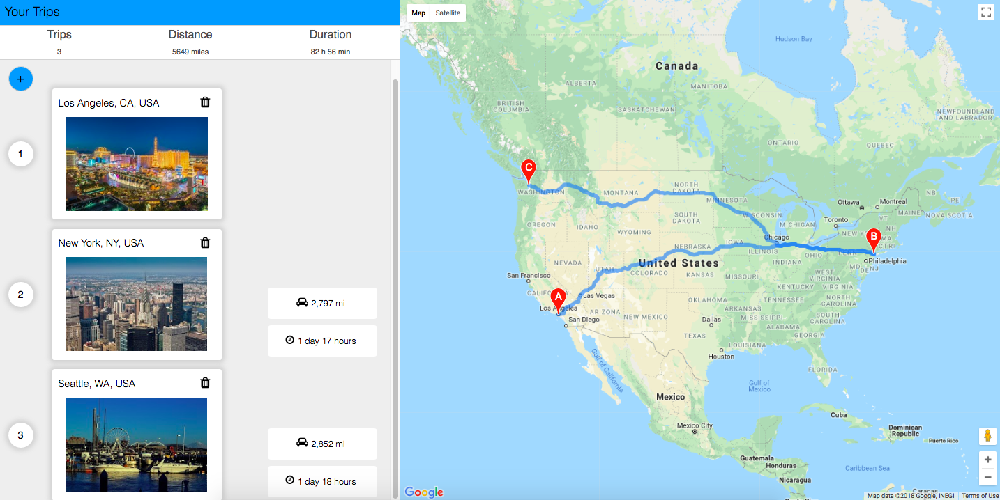

# Trip Planner

Built a trip planning app to determine the distance and time between 1 to 6 destinations. The web app was built using react and the google maps api. The web app allows the user to pick up to 6 destinations to determine their total distance and duration of the trip.

## Built With

- [React](https://reactjs.org/) - Front End Framework
- [Google Maps Api](https://developers.google.com/maps/documentation/) - External Api
